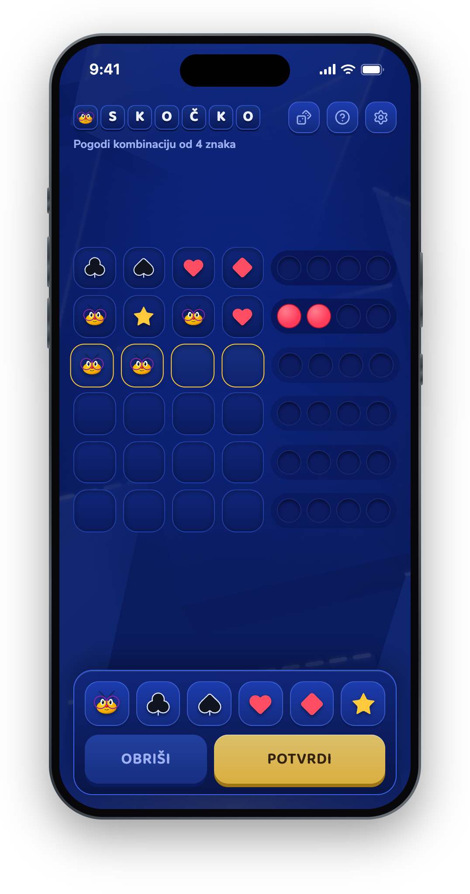
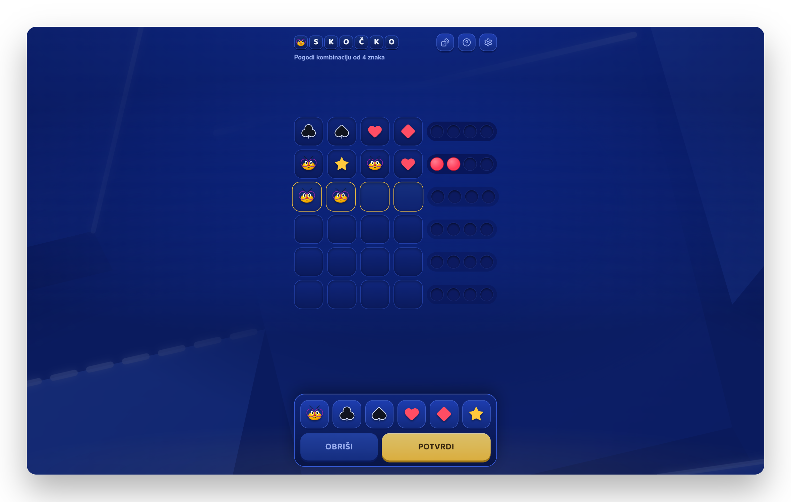

# Skočko

A mobile-first, Mastermind-style code-breaking game. Skočko is the game's beloved mascot — and one of the six symbols you'll be guessing.

**▶ Play it live: [skocko-game.vercel.app](https://skocko-game.vercel.app)**

<p align="center">
  
  &nbsp;
  
</p>

## How to play

The computer hides a combination of **4 symbols** drawn from six: Skočko, club, spade, heart, diamond and star. Symbols can repeat and order matters. You have **6 attempts** to crack it.

After each guess you get pegs:

- 🔴 **red** — right symbol on the right position
- 🟡 **yellow** — right symbol on the wrong position

The pegs are sorted (reds first), so they tell you *how many* you got — not *which ones*. Each hidden symbol counts only once, even if you guess it multiple times.

## Features

- **Bilingual** — Serbian and English, switchable in settings
- **Timer mode** — limited time per game for extra pressure
- **Share your result** — the finished board is rendered to an image and shared straight to the X app on mobile, or via a download/post dialog on desktop
- **Installable PWA** — add it to your home screen for a fullscreen, app-like experience with iPhone haptics
- **Accessible** — labelled controls, screen-reader-friendly symbol tray

## Tech stack

- [React 19](https://react.dev) + [TypeScript](https://www.typescriptlang.org), built with [Vite](https://vite.dev)
- [Tailwind CSS 4](https://tailwindcss.com) for styling
- [Radix UI](https://www.radix-ui.com) + [vaul](https://vaul.emilkowal.ski) for dialogs and sheets
- [Vitest](https://vitest.dev) + [Testing Library](https://testing-library.com) for tests

## Development

```bash
pnpm install
pnpm dev        # start the dev server
pnpm test       # run the test suite
pnpm build      # typecheck + production build
pnpm preview    # serve the production build locally
```

## Testing

The scoring engine is verified **exhaustively**: every one of the 1296 × 1296 secret/guess pairs is checked against the closed-form formula from Knuth's Mastermind paper, so the peg logic provably matches the real game. On top of that, the full app is covered by state-machine tests — guessing, winning, losing, the timer, and everything in between.

## License

[MIT](LICENSE)
